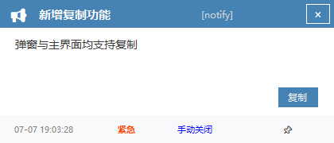
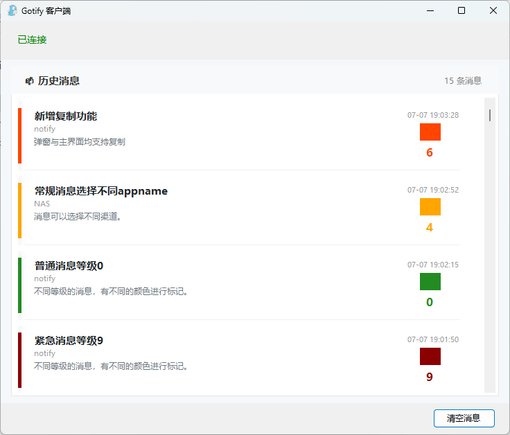
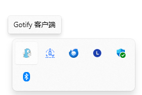
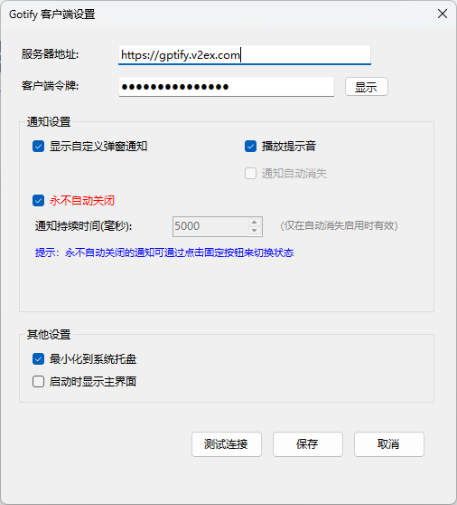

# Gotify Windows 托盘客户端


一个基于 .NET 8 和 Windows Forms 的 Gotify 客户端，提供系统托盘集成、实时消息接收和通知展示功能。


## 功能特性

- **系统托盘集成**：最小化到系统托盘，支持右键菜单操作
- **实时消息接收**：通过 WebSocket 连接实时接收 Gotify 服务器推送的消息
- **消息历史记录**：自动保存接收到的消息，支持应用重启后恢复历史消息
- **多种通知方式**：
  - **自定义弹窗通知**：显示在屏幕右上角的通知窗口
  - 系统托盘图标闪烁
  - 可选声音提醒
  - **灵活的显示控制**：支持自动消失或手动关闭
- **配置管理**：持久化保存用户配置
- **连接测试**：内置连接测试功能

## 技术架构

### 核心组件

1. **MainForm**：主窗体，提供用户界面和消息显示
2. **GotifyWebSocketService**：WebSocket 服务，负责与 Gotify 服务器建立连接
3. **NotificationService**：通知服务，处理各种通知方式
4. **ConfigService**：配置服务，管理用户设置的持久化
5. **NotificationForm**：自定义通知窗口
6. **SettingsForm**：设置窗口

### 数据模型

- **GotifyMessage**：消息实体
- **GotifyApplication**：应用实体
- **GotifyConfig**：配置实体

## 使用方法


1. 运行程序
2. 点击“设置”按钮，填写 Gotify 服务器地址和客户端令牌，保存后返回主界面
3. 可点击“测试连接”验证配置是否正确
4. 保存设置后自动连接到服务器，主界面将显示历史消息和实时推送
5. 可通过“清空消息”按钮一键清除所有历史消息

# 截图预览

自定义弹窗通知示例。



主界面示例



系统托盘图标示例



设置窗口示例




## 配置选项

- **服务器地址**：Gotify 服务器的 URL
- **客户端令牌**：用于接收消息的客户端令牌
- **显示自定义弹窗通知**：是否显示右上角的自定义通知窗口（推荐）
- **播放提示音**：是否播放系统提示音
- **通知自动消失**：通知窗口是否自动消失，关闭后需手动点击关闭
- **最小化到系统托盘**：是否支持托盘最小化
- **通知持续时间**：通知窗口显示时长（毫秒）仅在自动消失启用时有效
- **启动时显示主窗口**：是否在程序启动时自动显示主界面
- **储存位置**：配置文件存储在 `%APPDATA%\GotifyClient\config.json`

## 消息历史记录功能

### 自动保存和恢复
- **本地持久化存储**：所有接收到的消息都会自动保存到本地JSON文件中
- **应用重启恢复**：程序启动时自动加载之前保存的历史消息
- **存储位置**：`%APPDATA%\GotifyClient\message_history.json`
- **智能容量管理**：自动限制最大保存消息数量（1000条），超出时删除最旧的消息
- **线程安全**：使用异步保存机制，不会阻塞UI操作

### 历史消息管理
- **一键清除**：通过"清除"按钮可以同时清除界面显示和本地历史记录
- **时间排序**：消息按时间顺序显示，最新消息在顶部
- **完整信息保留**：保存包括消息内容、标题、优先级、时间戳等完整信息

### 技术实现
- **最小化改动**：基于现有ConfigService模式，复用JSON序列化机制
- **高性能**：异步文件操作，避免UI卡顿
- **数据安全**：异常处理机制，确保数据丢失时不影响程序正常运行

## 界面美化功能

### 历史消息显示美化
- **现代化消息卡片设计**: 每条消息以卡片形式展示，包含优先级色条、应用图标、状态指示器
- **响应式布局**: 消息项会根据窗口大小自动调整宽度，在不同分辨率下都有良好显示效果
- **优先级视觉标识**: 
  - 高优先级消息 (红色)
  - 普通优先级消息 (蓝色)  
  - 低优先级消息 (绿色)
- **悬停交互效果**: 鼠标悬停时消息项背景变化，增强交互体验
- **智能文本处理**: 长消息自动换行显示，超长内容显示省略号
- **消息详情对话框**: 点击消息项打开美化的详情窗口，显示完整内容和元数据

### 主窗口界面优化
- **优雅的空状态**: 无消息时显示友好的提示界面
- **实时消息计数**: 顶部显示当前消息总数
- **现代化配色方案**: 采用清新的蓝灰色调，符合现代 UI 设计趋势
- **平滑滚动体验**: 新消息自动滚动到顶部，保持最新消息可见

### 应用名称显示功能
- **智能应用名称解析**: 自动从 Gotify 服务器获取应用的真实名称，替代冷冰冰的应用ID
- **应用名称缓存**: 本地缓存应用名称，避免重复请求，提升性能
- **默认名称映射**: 为常见应用ID提供友好的默认名称（如"系统通知"、"服务器监控"等）
- **多处显示**: 应用名称在消息列表和详情对话框中都有显示
- **容错处理**: 当无法获取应用名称时，优雅降级为默认名称

### 消息详情对话框优化
- **更大的窗口尺寸**: 从 500x400 增加到 650x550，提供更好的内容显示空间
- **可调整大小**: 支持窗口大小调整和最大化，适应不同长度的消息内容
- **改进的布局系统**: 使用 Dock 布局确保控件不会重叠或被遮挡
- **增强的文本显示**: 
  - 更大的字体 (11号) 提升可读性
  - 支持自动换行的多行文本框
  - 垂直滚动条支持长消息查看
- **实用功能按钮**:
  - "复制内容" 按钮一键复制消息文本到剪贴板
  - 复制成功后的视觉反馈
  - 美化的按钮样式和交互效果
- **信息展示优化**:
  - 更清晰的信息分区布局
  - 详细的元数据显示 (时间、优先级、消息ID、应用ID)
  - 优雅的分隔线和间距设计

### 布局修复和优化
- **消息文本框右侧边界修复**: 修复了消息内容文本框超出窗口边界的问题
- **响应式布局**: 使用 Dock 布局确保文本框在所有窗口大小下都有正确的边距
- **智能边距**: 统一的 25px 左右边距，20px 上下边距，提供最佳的阅读体验
- **自适应大小**: 文本框自动填充可用空间，无需手动计算尺寸
- **视觉优化**: 添加了视觉元素增强界面友好性

## 依赖项

- .NET 8.0
- Windows Forms（System.Windows.Forms）
- Newtonsoft.Json
- System.Net.WebSockets.Client

## 构建和运行

```bash
# 还原 NuGet 包
dotnet restore

# 构建项目
dotnet build

# 运行项目
dotnet run
```

## 系统要求

- Windows 10 或更高版本
- .NET 8.0 运行时


## 注意事项

- 首次运行需要点击“设置”并填写服务器地址和客户端令牌，否则无法连接 Gotify 服务器
- 配置文件存储在 `%APPDATA%\GotifyClient\config.json`

### 代码修复记录 

- 2025-07-04

- **修复 MainForm.cs 语法错误**: 解决了多处字符串编码问题和缺失引号导致的27个编译错误
- **字符串编码修复**: 修复了"客户端"、"连接"、"消息"等中文字符显示问题
- **引号修复**: 修复了所有未闭合的字符串引号
- **编译成功**: 所有语法错误已解决，项目现在可以正常编译和运行

### 模型增强
- **新增 AppName 属性**: 在 GotifyMessage 模型中添加了可选的应用名称字段，支持更丰富的消息显示

- 2025-07-07
- **修复断连接**: 新增了断网重连机制，确保在网络中断后能够自动重新连接到 Gotify 服务器
- **添加复制按钮**: 在消息详情对话框中添加了“复制内容”按钮，支持一键复制消息文本到剪贴板

## 编译

```
dotnet publish -c Release -r win-x64 --self-contained false -p:PublishReadyToRun=true -p:IncludeNativeLibrariesForSelfExtract=true -p:DebugType=None -p:DebugSymbols=false
```

## TODO

- [x] 断网重连
- [ ] 验证码提取